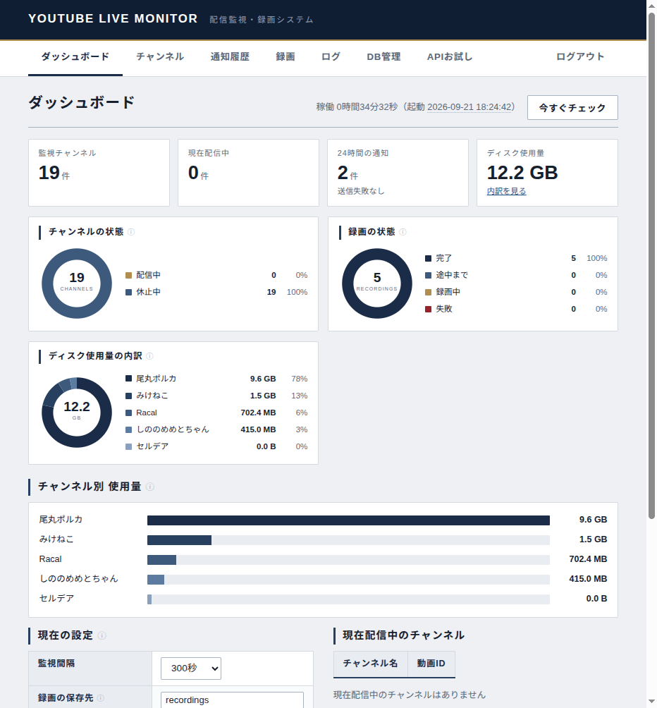
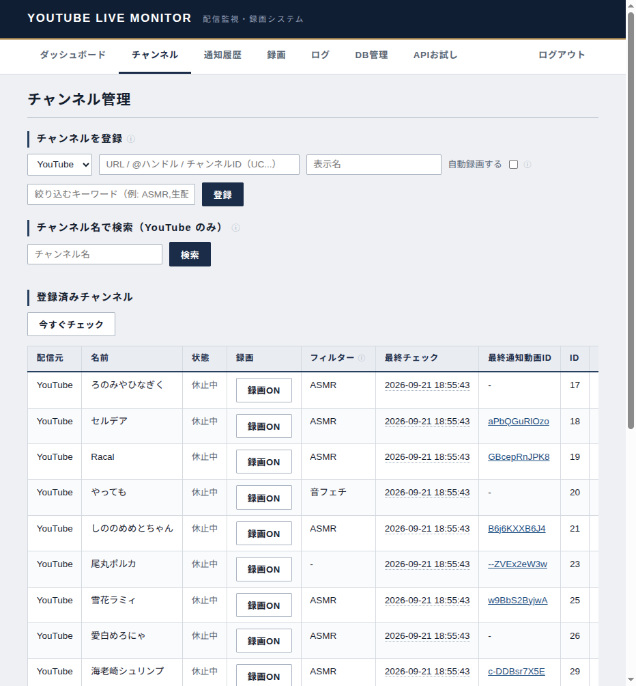
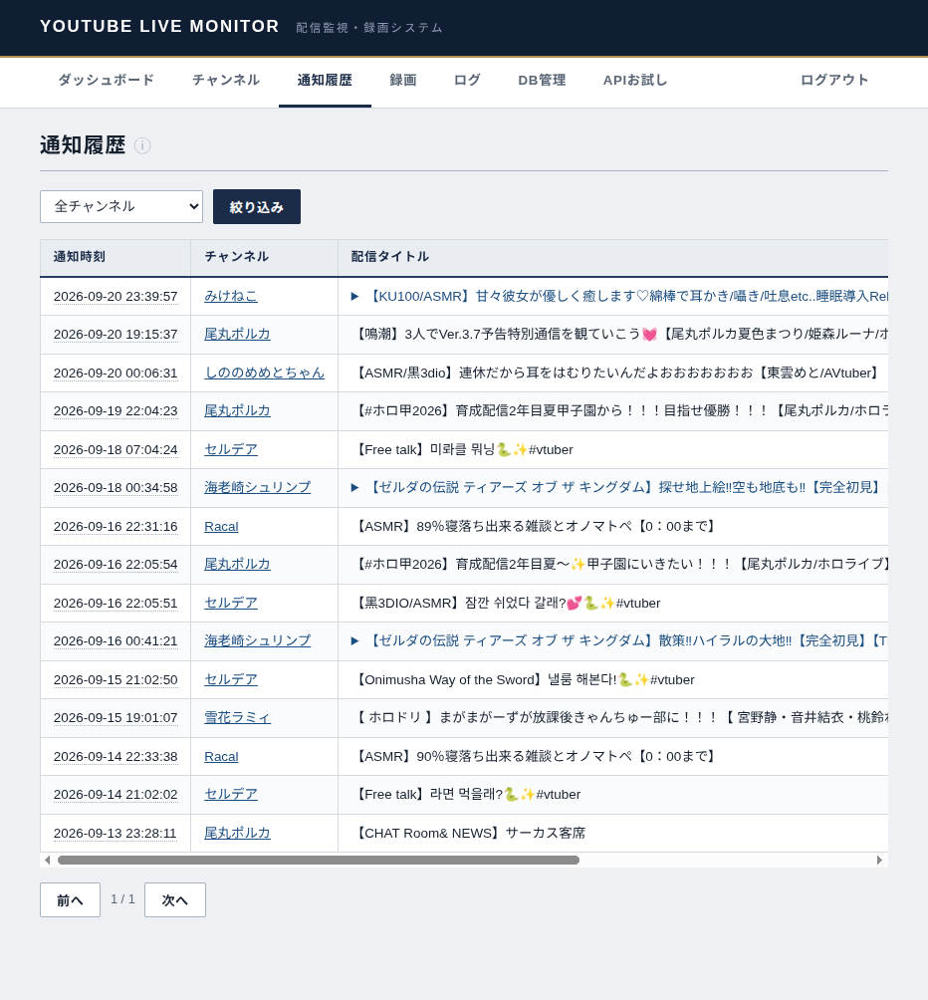
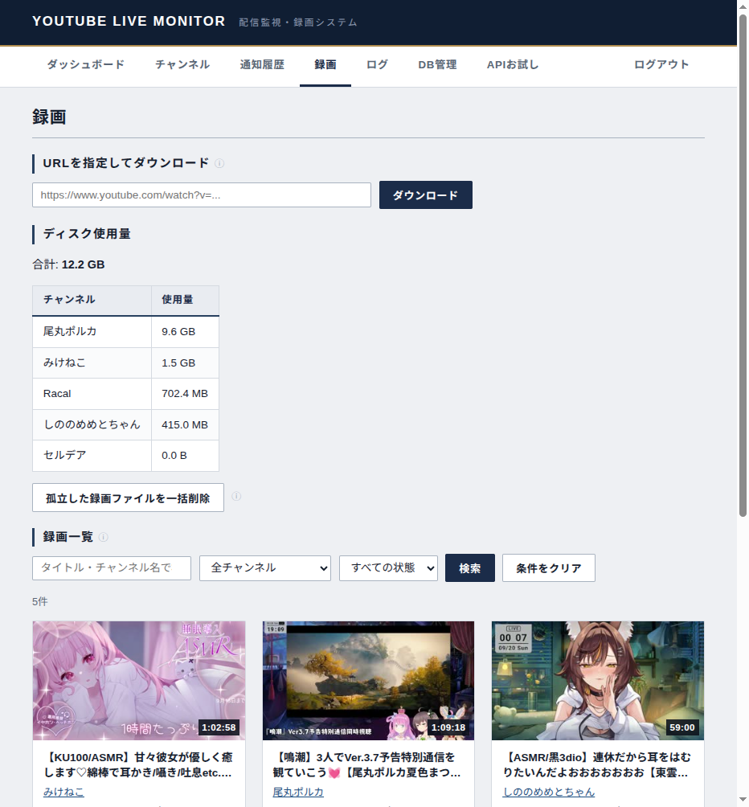

# サービス改善調査 — 画面・表示内容・操作導線

調査日：2026-09-21／対象：YouTube Live Monitor の現在の管理画面

## 1. 判断の要点

**優先すべきは「表示を信頼できること」と「問題の理由から対処へ進めること」。** 現状は必要な機能が揃っている一方、配信・通知・録画の状態が画面間で分散し、ID・ログ・設定の意味を利用者が補って理解する場面が多い。

先に取り組む項目は次の5つ。

1. Twitch のリンクを YouTube へ向けてしまう処理を修正する。
2. フィルターの再編集で古い値に戻る問題を修正する。
3. 「現在配信中」を観測時刻付きの表示にし、判定不能と古い表示を区別する。
4. 設定の「適用中」と「保存済み・再起動待ち」を分ける。保存先変更の影響も説明する。
5. DB管理を通常の運用画面から分離し、認証情報の表示・直接編集を制限する。

その後、監視状況をダッシュボード上部に、録画一覧を録画画面上部に移す。色や装飾の変更より、情報の意味と並び順の改善が効く。

## 2. 調査範囲と確度

| 項目 | 実施内容 |
|---|---|
| 実画面 | 稼働中の localhost:8080 に管理者としてログイン。ダッシュボード、チャンネル、通知履歴、録画、再生、ログ、DB管理、APIお試しを閲覧 |
| 実データ | 調査開始時点で監視19件、配信中0件、録画5件（完了）、録画ディレクトリ使用量12.2 GB。時点値であり固定の仕様ではない |
| 表示サイズ | 通常画面は約932×1004px。320px幅は同一オリジンの iframe 内でレスポンシブ表示を検証 |
| コード | 全9 HTML、対応JS、共通CSS、関連DTO・Controller・Serviceを確認 |
| 更新操作 | 設定保存、登録・削除、録画開始、手動巡回、外部APIお試しの実行は行っていない |
| 再生 | 完了録画1件の詳細表示と動画の読み込み（readyState=4）を確認。全編再生・シーク品質・全コーデックは未検証 |
| 対象外 | 一般利用者権限の実機検証、障害注入、実際のTwitch配信中画面、タッチ端末・スクリーンリーダーでの操作 |
| 作業結果 | この資料と画像のみを作成。本番コード・設定・DBは変更せず、ビルド・再起動も未実施 |

確度の表記：**実画面**＝表示で確認、**コード**＝実装上の経路を確認（本番更新による再現は未実施）、**提案**＝利便性・情報設計についての評価。

Git管理情報がないため、コミットや差分ではなく現在のファイルを根拠とした。前回のコードレビュー資料の「未修正」表示は今回の判定根拠にしていない。

## 3. 良い点として維持するもの

- 配信していない状態と判定失敗を区別するチャンネル表示。
- 録画の「途中まで」を失敗と分け、再生可能にする扱い。
- 実ファイルを走査する使用量集計。DBにない断片も把握できる。
- 表の横スクロールと長文の折りたたみ。行を不用意に折り返さない方針。
- 録画のタイトル検索・状態フィルター、実行中の録画が表示されている間の自動更新。
- ログに実在するレベルだけを選べること。
- 設定APIが秘密情報そのものを返さないこと、APIお試しに消費量の注意があること。
- 色・余白・タイポグラフィが画面間で統一されていること。

## 4. 優先順位一覧

P1＝誤操作・誤認や正常利用への影響が大きく先に対応、P2＝日常操作と障害対処を改善、P3＝仕上げ・補助。工数の大小は相対評価で、日数の見積もりではない。

| ID | 優先度 | 改善点 | 根拠 | 変更範囲 |
|---|---|---|---|---|
| UI-01 | P1 | TwitchにもYouTubeリンクが生成される | コード | DTO・保存情報・共通リンク |
| UI-02 | P1 | フィルターを再編集すると古い値になる | コード | チャンネルJS・小 |
| UI-03 | P1 | 現在値と最終観測値、判定不能が混在する | 実画面＋コード | 集計API・表示・中 |
| UI-04 | P1 | 設定の保存済みと適用済みを区別できない | コード | 設定API・画面・中 |
| UI-05 | P1 | DB管理が認証情報を表示し、汎用編集できる | 実画面＋コード | DB管理API・画面・中 |
| UI-06 | P2 | ダッシュボードで容量グラフが監視状況より先 | 実画面＋提案 | 画面構成・中 |
| UI-07 | P2 | 通知・録画しない理由が分からない | コード＋提案 | 判定結果の保持・API・大 |
| UI-08 | P2 | フィルター・録画ON/OFFの意味が不明瞭 | 実画面＋コード | 文言・編集導線・中 |
| UI-09 | P2 | 通知の結果列が初期表示で見えず、失敗を絞れない | 実画面＋コード | 表・検索API・中 |
| UI-10 | P2 | 録画一覧が下方にあり、開始した取得が条件に隠れる | 実画面＋コード | 画面・検索状態・中 |
| UI-11 | P2 | 録画失敗・途中まで・再生エラーの次の操作がない | 実画面＋コード | 詳細API・画面・中 |
| UI-12 | P2 | 削除対象と残るデータが十分に見えない | コード＋提案 | 削除プレビューAPI・中〜大 |
| UI-13 | P2 | 使用量は分かるが、録画を継続できる空き容量は不明 | 実画面＋コード | 容量API・表示・中 |
| UI-14 | P2 | ログの対象を名前で探せず、障害画面からつながらない | 実画面＋コード | ログAPI・画面・中 |
| UI-15 | P2 | ラベル・キーボード操作・エラー通知に不足 | 実画面＋コード | 共通UI・各フォーム・中 |
| UI-16 | P2 | 320px幅でダッシュボード全体が横にはみ出す | 実測＋コード | CSS・小 |
| UI-17 | P2 | 非同期の成功が別のエラーを消す、応答順も未制御 | コード | 共通API表示・各画面・中 |
| UI-18 | P3 | 空状態・ページ移動・APIクォータ・文言を整える | 実画面＋コード | 画面・小〜中 |

## 5. 修正候補の詳細

### UI-01：プラットフォームをまたぐリンクの誤り

**現状**：`common.js` の `videoLink()` は常に `youtube.com/watch?v=...`、`channelLink()` は常に `youtube.com/channel/...` を作る。通知履歴、録画カード、再生詳細、ダッシュボード、チャンネルの最終通知欄で利用されている。Twitchの数値IDでもYouTubeのURLになってしまう。

`RecordingResponse`、`NotificationHistoryResponse`、`DashboardResponse.LiveChannelSummary` には視聴URLや配信元がない。JSの文字列置換だけでは正しく直せない。

**改善**：DTOに配信元と適切なURLを渡し、共通部品は渡されたURLを描画する。履歴に必要な視聴URL・元ページURLは取得時に保存する。Twitchの配信IDとVOD IDを混同せず、配信者の現在のページと当時のアーカイブへのリンクを区別する。既存行でURLを確定できない場合はリンク無しの表示にする。

**受け入れ条件**：YouTube・Twitch・未登録動画・URLを持たない既存履歴の全画面で、誤ったサービスへリンクしない。URLを補うために各画面表示から外部APIを毎回呼ばない。

根拠：`js/common.js::videoLink/channelLink`、`js/dashboard.js::loadDashboard`、`js/notifications.js::loadHistory`、`js/player.js::renderDetail`、上記DTO。

### UI-02：フィルター再編集時に古い値が復活する

**現状**：`loadChannels()` のダブルクリック処理は読み込み時の `ch.recordTitleKeywords` を渡す。`editTitleFilterCell()` は保存後にセルの文字だけ変更し、`ch` を更新しない。

例：元の `ASMR` を `雑談` に保存→ページを再読み込みせず再編集すると、入力欄が `ASMR` で開く。Escapeで取り消すと表示も古い値になる。入力内容によっては意図しない保存につながる。今回は本番設定を変更せず、コード経路で確認した。

**改善**：保存成功時に画面の状態モデルを更新するか、対象行をAPIから再取得する。編集ボタンと保存・取消を明示し、操作中の重複編集も防ぐ。

**受け入れ条件**：A→B保存→再編集でBが開く。取消でBを維持。保存失敗時も直前に保存済みの値へ戻る。

根拠：`js/channels.js::loadChannels/editTitleFilterCell`。

### UI-03：「現在」と「最後に分かった状態」を分離する

**現状**：ダッシュボードは初期読み込みと「今すぐチェック」後に取得するだけで、開いたままでは更新しない。稼働時間も止まった表示になる。「今すぐチェック」は表示更新ではなく、通知・録画を伴いうる巡回操作。

さらに `DashboardService` は判定失敗中も保持する `currentlyLive` を件数に含める。円グラフは全件を「配信中／休止中」に分けるが、警告は連続2回失敗から。チャンネル画面では1回失敗から「判定失敗」。同じチャンネルを異なる意味で読ませている。

**改善**：正常に観測できた配信中／未配信／判定不能／未チェックを表示上で区別する。DB上の最後の正常な状態は保持したまま、判定不能には最終成功時刻と以前の状態を添える。画面更新時刻、巡回最終完了時刻、監視間隔を表示する。「表示を更新」と「今すぐ巡回」を分ける。

**受け入れ条件**：判定失敗をfalseへ書き換えず、不明なものを現在の確定値として数えない。巡回の停止・長時間化と単なる画面の古さを区別できる。GETによる表示更新で通知や録画を起動しない。

根拠：`DashboardService::getSnapshot`、`js/dashboard.js::renderChannelStatusChart/loadDashboard`、`js/channels.js::channelStateLabel`。

### UI-04：設定保存と適用の二段階を見せる

**現状**：PUTは`.env`だけを変更し、GETは起動時の`MonitorProperties`を返す。保存直後は再起動が必要と表示するが、再訪問するとその表示はなくなり、フォームも適用中の旧値へ戻る。再度保存すると監視間隔・画質など旧値を送り、保留中の変更を上書きしうる。

保存先も同じ問題を持つ。録画のパスは相対パスで、静的配信のルートは設定したディレクトリ。保存先を変えるだけでは過去のファイルは移動しないため、既存録画を新しいルートから探して再生できなくなる可能性がある。現行画面に移動・参照の説明はない。

**改善**：設定を専用画面にし、「適用中」「保存済み」「再起動待ち」を永続的に表示する。変更した項目だけ送信する。秘密情報は値を戻さず、設定済み・変更予定だけ返す。保存先変更は過去ファイルの扱いを説明し、移行手順または旧保存先の参照設計を用意する。

**受け入れ条件**：保存後に再訪しても保留内容を把握でき、別項目の保存で消えない。反映後に保留表示が消える。保存先変更後の既存録画の扱いが事前に分かる。再起動ボタンの追加だけで解決したことにしない。

根拠：`SettingsController::getSettings/updateSettings`、`EnvironmentSettingsService`、`js/dashboard.js::loadSettings` と保存ハンドラー、`RecordingResourceConfig`。

### UI-05：DB管理を通常操作から分離する

**現状**：DB管理は他の画面と同格のナビにあり、初期選択で「ログイン利用者」が表示された。パスワードハッシュも列として表示される。主キー以外はダブルクリック編集が可能で、フォーカスが外れると即保存する。サーバー側の除外テーブルは`AUDIT_LOGS`のみ。

管理者限定の画面であり、公開漏えいを確認したという指摘ではない。ただし画面共有時の不要な露出、権限や認証情報の誤編集、業務上の正規化処理を通さない更新が起きやすい構成。

**改善**：ナビの「管理・診断」配下へ移し、既定は閲覧専用にする。認証情報のテーブル・列は汎用取得APIでも除外またはマスクする。編集モードへの明示的切り替え、変更前後の確認、保存・取消を設ける。チャンネル設定などは通常画面から編集できるようにする。

**受け入れ条件**：パスワードハッシュが一覧API・DOMに含まれない。セルを見ようとしてクリックを外しただけでは更新されない。認証・権限変更は専用の検証付き操作を通す。未知の通常テーブルを閲覧できる既存の拡張性は維持する。

根拠：`tables.html`、`js/tables.js::editCell`、`DatabaseTableService::getTableData/filterUpdatableColumns`。認証情報が含まれるため、DB管理の画像・スナップショットは成果物に含めていない。

### UI-06：ダッシュボードの主役を監視状況に戻す

**現状**：KPI→円グラフ3つ→チャンネル別容量棒グラフ→設定・配信中一覧の順。約932px幅ではグラフが2列になり、3枚目の右に空白ができる。配信中一覧の見出しは画面上端から約890pxで、最初に見たい情報へ視線が届きにくい。

**改善**：上から「要対応」「巡回の健康状態」「配信中・録画中」「最近の結果」。ディスク内訳は容量管理へ移すか折りたたむ。容量の円グラフと棒グラフは併置の利点もあるため、詳細画面で比較する用途に残す。

**受け入れ条件**：主要なデスクトップ幅で、初期表示から監視の正常性と配信中・録画中の概要が分かる。警告・件数から絞り込み済みの一覧へ遷移できる。

### UI-07〜UI-18：その他の改善と確認条件

| ID | 現状・影響 | 改善案 | 受け入れ条件／主な根拠 |
|---|---|---|---|
| UI-07 | 配信中でも通知済み・フィルター対象外・通知上限・録画開始失敗の区別を画面で追えない | チャンネル詳細に「直近の判定理由」「一致したタイトル／カテゴリ」「通知結果」「録画結果」を表示し、対応する履歴・ログへつなぐ | 外部APIを追加で常時呼ばず、既存巡回の判定結果を返す。フィルター対象外と取得失敗を分ける。根拠：Schedulerの各return経路と`MonitoredChannelResponse` |
| UI-08 | フィルターは通知と録画両方に効くが、登録時は短いplaceholderだけ。編集はダブルクリック。「録画ON」は実際の録画中とも読める。名前編集も通常画面にない | 「通知・録画の条件」に改称し、カンマ区切りOR・タイトルまたはカテゴリ・空なら全件を短文で常時表示。「自動録画：有効」と「録画中」を分ける。行に設定ボタンを置く | キーボードでも条件編集可能。登録フォームと検索経由登録の初期設定の違いが分かる。根拠：`channels.html`、`js/channels.js`、`MonitoredChannelController` |
| UI-09 | 結果列が長いタイトルの右にあり、実画面では横スクロールしないと読めない。失敗・期間による絞り込みがない | 列順を「時刻・結果・チャンネル・タイトル・詳細」に変更。結果、期間、キーワードで絞り込み。動画IDは詳細へ | 初期表示で成功・失敗が判別できる。ダッシュボードの失敗件数から失敗一覧へ遷移。根拠：`notifications.html`、`js/notifications.js` |
| UI-10 | 録画一覧の見出しは約657px、カード開始は約770px。URL取得開始後はページ番号だけ0に戻り、以前の検索条件が残るので開始した動画が隠れる場合がある。自動更新も表示中にRECORDINGがある場合だけ | 録画一覧を先頭へ。URL取得は「追加」パネル、容量管理は別区画へ。取得開始後に対象カード／進捗へのリンクを表示。更新状態を明示 | 「完了」絞り込み中に取得開始しても進行を追える。空ページから新規録画を発見できる。根拠：`recordings.html`、`js/recordings.js::scheduleRefreshWhileRunning` と取得開始処理 |
| UI-11 | FAILEDカードは詳細へ移動できず、削除以外の対処が見えない。再生詳細に状態がなく、PARTIALの説明もない。videoのerrorを説明する処理がない | 再生可否と詳細閲覧を分離。状態、理由、ログ、元ページ、ファイル有無を詳細で表示。再生エラーを利用者向けに説明 | 完了・途中まで・失敗・録画中すべてで状態の意味を確認可能。404や非対応形式で無言の黒画面にならない。根拠：`common.js::buildVideoCard`、`player.js::renderDetail/load` |
| UI-12 | チャンネル削除確認は履歴が消えることを伝えるが、ファイルが残ること・進行中録画が続くことは伝えない。一括削除は対象件数・容量を見ずに確定する | チャンネル名と失う情報・残るファイルを確認画面に明示。一括削除は事前プレビューで対象・容量・除外理由を表示 | 録画中のものは実行時にも再確認して除外。プレビュー後の状態変化で誤削除しない。根拠：`channels.js`、`recordings.js`、`RecordingFileService` |
| UI-13 | 「12.2 GB」は録画ディレクトリの使用量であり、ボリュームの空き容量・残り割合は表示されない | 「録画ファイル使用量」と明記。保存先の空き容量・総容量・取得時刻を追加し、容量低下を目立たせる | 保存先ボリュームの値を返し、取得失敗を0と表示しない。録画継続可能時間を出すなら変動する推定値と明記。根拠：`DiskUsageResponse`、ダッシュボード・録画画面 |
| UI-14 | ログ対象の選択肢がUC IDや数値IDのみ。警告には「ログを確認」とあるが、対象ログへのリンクがない | 登録名＋配信元＋IDで表示し、削除済みはIDを残す。チャンネル・通知・録画から対象と期間を渡す。本文検索を追加 | 失敗の対象をIDの手作業コピーなしで探せる。レベル選択肢は絞り込み前の実データから集める方針を維持。根拠：`js/logs.js::loadChannelOptions` |
| UI-15 | 設定フォームは行見出しがあるが入力とのlabel関連付けがなく、実際のアクセシビリティツリーで名前のないcomboboxがある。日時・IDの開閉はclickのみ。重要説明はtitle頼み | label/for、button、キーボード操作、短い常時説明を追加。成功通知はstatus、失敗はalertとして通知。編集完了時のフォーカスを管理 | マウスなしで登録・編集・開閉可能。各入力が一意の名前を持つ。タッチでも条件の意味を確認できる。根拠：各HTML、`common.js::datetimeCell/bindDatetimeCells` |
| UI-16 | 320px iframeでdocument.scrollWidth=346px、`.infoRow`内の子は330px固定下限。表内でなくページ全体が横に広がる | 狭い幅では`.infoRow`を1列・最小幅0にし、内部の表だけ横スクロールさせる | 320/360/390/768pxでdocument幅がviewportを超えない。実機タッチ検証は別途必要。根拠：`css/style.css`の`minmax(330px, 1fr)`と実測 |
| UI-17 | 録画画面は一覧と容量を並列取得し、片方の成功が共通`clearError()`で他方の失敗を消せる。検索変更時の古い応答を排除する仕組みもない | セクション別の読込・失敗・再試行表示を持たせる。リクエスト番号またはAbortControllerで古い応答を捨てる | 一覧失敗＋容量成功でも一覧のエラーが残る。検索A→Bの応答が逆順でもBの結果を表示。根拠：`recordings.js::loadRecordings/loadDiskUsage`、`common.js::clearError` |
| UI-18 | 1/1でも前・次ボタンが有効。通知履歴には0件の説明がない。取得動画も「録画中」。APIお試しのクォータはアプリ起動後の累計だが表示に期間がない | 境界ボタンを無効化。初回0件と検索0件を区別。録画とダウンロードの種別を表示。「起動後のAPIお試し消費量（サービス全体の残量ではない）」と明記 | 最終ページの最後の削除後も存在するページへ戻る。クォータを日次残量と誤読しない。根拠：各ページャー、`RECORDING_STATUS_LABEL`、`ApiPlaygroundService::sessionQuotaTotal` |

## 6. 画面別の構成案

既存機能は次のように配置すると、日々見るものと変更するときだけ見るものを分けられる。

| 画面 | 最初に見せる内容 | 詳細・補助へ移す内容 |
|---|---|---|
| ダッシュボード | 要対応、最終巡回、観測の鮮度、配信中・録画中、最近の失敗 | 設定フォーム、容量の全チャンネル内訳 |
| チャンネル | 検索・配信元・状態フィルター、登録済み一覧、行の設定ボタン | 新規登録パネル、YouTube名検索、技術的ID |
| 通知履歴 | 失敗／成功・期間フィルター、時刻と結果を左に配置 | 動画ID、長いエラー全文、同一配信への再試行一覧 |
| 録画 | 検索・状態フィルター、進行中の取得、録画カード | URL追加パネル、容量詳細、一括削除 |
| 録画詳細 | タイトル、状態、再生可能性、プレーヤー、失敗時の対処 | 保存先・ID、低頻度の削除操作 |
| 設定（新設） | 適用状態、監視間隔、保存先・画質、接続設定 | APIの内部用語、再起動手順の詳細 |
| 管理・診断 | 名前で探せるログ、DB閲覧、APIお試しへの入口 | 危険度のあるDB編集、認証情報の専用管理 |
| ログイン | 現行のシンプルなラベル付きフォーム | エラーの読み上げ対応を追加。一般利用者のログイン後導線は別途検証 |

### ダッシュボード上部の表示例（提案・実データではない）

```text
ダッシュボード                         表示を更新  今すぐ巡回
表示更新 19:05／最終巡回完了 19:04／監視間隔 5分

要対応 2件  [判定不能のチャンネルを見る] [通知失敗を見る]

監視対象 19  | 配信中 3 | 判定不能 1 | 録画中 2

配信中・録画中
チャンネル    配信元   観測時刻  通知         自動録画の結果
サンプルA     YouTube  19:04    送信済み      録画中
サンプルB     Twitch   19:04    条件対象外    条件対象外

最近の通知・録画結果                         履歴へ
保存先の空き容量                            容量管理へ
```

「条件対象外」などの理由は新たにAPIで運ぶ情報。現在のレスポンスだけで画面に足せるという意味ではない。

## 7. 文言の見直し例

| 現在 | 変更案 | 理由 |
|---|---|---|
| 休止中 | 配信していません（最終観測時点） | 活動休止・監視停止と混同しない |
| 録画ON / OFF | 自動録画：有効 / 無効 | 設定と実行状態を分ける |
| フィルター | 通知・録画の条件 | 通知にも作用することを明示 |
| 今すぐチェック | 今すぐ巡回 | 表示だけの更新と区別。必要に応じ通知・録画を実行すると補足 |
| 24時間の通知 | 24時間の送信試行 | 再試行と失敗を含む集計に合う。成功数を主に出す構成も可 |
| ディスク使用量 | 録画ファイル使用量 | 保存先全体の空き容量とは別の指標 |
| 孤立した録画ファイルを一括削除 | 履歴に紐づかないファイルを確認 | まず対象を確認してから削除する導線へ |
| ID | 管理ID | 配信元のチャンネルIDと区別 |

録画の説明「画質・音質は落とさず最高品質」は、画質上限設定がある現状と一致しない。「設定した画質上限で録画。使用量は配信時間と画質によって増えます」などへ変更する。

## 8. 実施順序と確認計画

### 第1段階：表示と編集の正しさ

UI-01〜05を対応。リンクに必要なデータと設定の保留状態を設計してから画面を直す。フィルター編集は独立した小さな修正として先行可能。

確認ケース：YouTube/Twitch混在、判定失敗1回・2回、未チェック、設定保存→再訪→別項目保存、認証列の取得、フィルター連続編集。

### 第2段階：毎日の操作と障害対処

UI-06〜14を対応。ダッシュボード・録画画面の並び替えと同時に、状態や失敗理由から対象の詳細へ進めるようにする。容量削除プレビューは実行時の録画中保護と組み合わせる。

確認ケース：通知対象外、再試行上限、録画開始失敗、途中まで、完了ファイル欠落、完了フィルター中の手動取得、削除プレビュー後に録画が始まる場合。

### 第3段階：操作品質を揃える

UI-15〜18を対応。ただしラベル・エラー表示・モバイル幅などの共通部品は第1・第2段階の各修正時にも適用する。

確認ケース：キーボードのみ、320〜768px、0件、最終ページで削除、片方だけAPI失敗、遅い旧検索応答、再ログイン後の遷移。

実装時は既存の警告ゼロ方針に従い、必要な回帰テスト、`./gradlew clean build`、`./gradlew javadoc`、JSの型確認を実施する。稼働jarを更新したらサービス再起動まで行う。今回の資料作成ではコード変更がないためビルドしていない。

## 9. 実画面の証拠

以下は調査時点のローカル画面。実在の登録名や録画タイトルを含むため、外部共有用に使う場合は内容を差し替える。認証情報・生ログのスナップショットは添付しない。

### ダッシュボード：容量グラフの下に監視一覧



### チャンネル：ID列と編集導線



### 通知履歴：結果列が右側へ押し出される



### 録画：一覧より上に取得フォームと容量内訳



追加画像：[再生詳細](ui-review-2026-09-21/player.png)、[APIお試し](ui-review-2026-09-21/playground.png)、[320px検証フレーム](ui-review-2026-09-21/dashboard-320-frame.png)。最後の画像は左端のiframeが検証対象で、背景は既存の再生画面。実機スマートフォンの画像ではない。

## 10. 根拠ファイル

画面ファイルはすべて [`src/main/resources/static`](../src/main/resources/static/) 配下。

- [共通表示・リンク・録画カード](../src/main/resources/static/js/common.js)
- [ダッシュボード](../src/main/resources/static/js/dashboard.js) ／ [チャンネル](../src/main/resources/static/js/channels.js)
- [録画一覧](../src/main/resources/static/js/recordings.js) ／ [再生詳細](../src/main/resources/static/js/player.js)
- [通知履歴](../src/main/resources/static/js/notifications.js) ／ [ログ](../src/main/resources/static/js/logs.js)
- [DB管理](../src/main/resources/static/js/tables.js) ／ [共通CSS](../src/main/resources/static/css/style.css)
- [集計サービス](../src/main/java/com/example/monitor/service/DashboardService.java)
- [設定API](../src/main/java/com/example/monitor/controller/SettingsController.java)
- [DB管理サービス](../src/main/java/com/example/monitor/service/DatabaseTableService.java)
- [巡回・通知判定](../src/main/java/com/example/monitor/scheduler/LiveStreamPollingScheduler.java)
- [DTO一覧](../src/main/java/com/example/monitor/dto/)

これらは修正案であり、対応完了を示す資料ではない。実装着手時には最新のコードと実データで再確認する。
